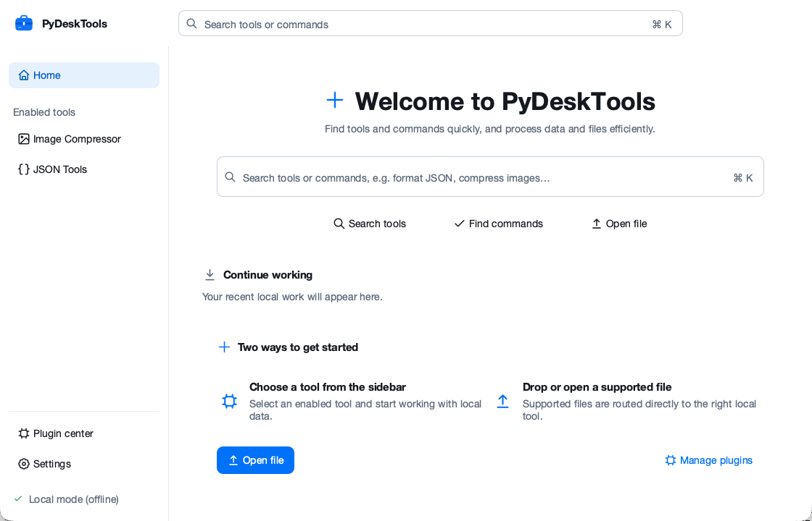

<p align="center">
  
</p>

<h1 align="center">PyDeskTools</h1>

<p align="center"><strong>Your everyday image and JSON utilities, in one private offline desktop app.</strong></p>

<p align="center">
  <a href="README.zh-CN.md">简体中文</a> ·
  <a href="https://github.com/openHacking/PyDeskTools/releases">Download</a> ·
  <a href="docs/plugin-sdk.md">Build a plugin</a>
</p>

<p align="center">
  <a href="https://github.com/openHacking/PyDeskTools/releases"></a>
  <a href="https://github.com/openHacking/PyDeskTools/actions/workflows/ci.yml"></a>
  <a href="LICENSE"></a>
  
  
</p>



PyDeskTools keeps small, frequent file tasks fast and local. It needs no account and
makes no network request at runtime. Version 0.1.0 includes two complete tools and an
isolated plugin architecture for adding more.

If PyDeskTools saves you time, a GitHub star helps other people discover it.

## What you can do

| Tool | Capabilities |
| --- | --- |
| **Image Compressor** | Batch-compress JPEG, PNG, and WebP; preview results; resize; preserve metadata; retry only failed items. |
| **JSON Tools** | Format or minify without losing large integers or decimal precision; import UTF-8 files; copy and export complete results. |

Use the sidebar, search, command palette, file picker, or drag and drop. English and
Simplified Chinese, light/dark appearance, plugin lifecycle controls, and a private
local data directory are built in.

## Download v0.1.0

PyDeskTools 0.1.0 is an experimental pre-release. Download only from the
[official GitHub Releases page](https://github.com/openHacking/PyDeskTools/releases).

| Platform | Artifact | Support and trust |
| --- | --- | --- |
| macOS 14+ on Apple silicon | `PyDeskTools-0.1.0-macos-arm64.dmg` | Developer ID signed beta, not notarized. Drag the app to Applications; first launch may require **Open Anyway** in Privacy & Security. |
| Windows 10/11 x64 | `PyDeskTools-0.1.0-windows-x64-unsigned.exe` | **Unsigned beta.** Windows SmartScreen may warn. Verify the SHA-256/provenance before running. |
| Linux x64 | `PyDeskTools-0.1.0-linux-x86_64.AppImage` | First-release support for X11 and XWayland on distributions compatible with Ubuntu 22.04. Native Wayland is not certified. |

On Linux, make the download executable before opening it:

```sh
chmod +x PyDeskTools-0.1.0-linux-x86_64.AppImage
./PyDeskTools-0.1.0-linux-x86_64.AppImage
```

Every release includes `SHA256SUMS.txt`, per-platform build manifests, third-party
license notices, and GitHub artifact attestations. Verify provenance with:

```sh
gh attestation verify PyDeskTools-0.1.0-PLATFORM -R openHacking/PyDeskTools
```

## Why it is trustworthy

- **Offline by design:** the shipped tools and their Python dependencies are bundled;
  documents and images stay on the device.
- **Explicit plugin boundary:** plugins run in separate Python processes and separate
  environments. This isolates dependencies and lifetime, but it is not an OS security
  sandbox—third-party plugins run with your user permissions and require consent.
- **Auditable releases:** native packages are built on their target operating systems
  from pinned sources, checked hashes, immutable tags, and least-privilege CI jobs.
- **Plain licensing:** the application is MIT licensed. Bundled dependency licenses and
  notices ship with every installer.
- **Honest limits:** 0.1.0 has no online catalog, automatic updater, screenshot tool, or
  certified Intel Mac/ARM Windows/ARM Linux build.

Read the [security policy](SECURITY.md), [architecture](docs/architecture.md), and
[implemented API](docs/implemented-api.md) for the exact boundary.

## Develop from source

Development requires Python 3.13+ linked to Tcl/Tk 9 and PyDeskUI 0.2.x. The packaged
plugin worker uses a separate pinned CPython 3.13 runtime. Start with the
[development guide](docs/development.md); release builders and signing requirements
are documented in the [release guide](docs/build-release.md).

```sh
python -m pip install -e ../PyDeskUI \
  -e packages/pydesktools-sdk \
  -e packages/pydesktools-runtime \
  -e plugins/json-tools \
  -e plugins/image-compressor \
  -e '.[dev]'
python scripts/build_bundles.py --target macos-arm64
python -m pytest
python -m pydesktools
```

Contributions are welcome. Please read [CONTRIBUTING.md](CONTRIBUTING.md) and the
[Code of Conduct](CODE_OF_CONDUCT.md) before opening a change.
