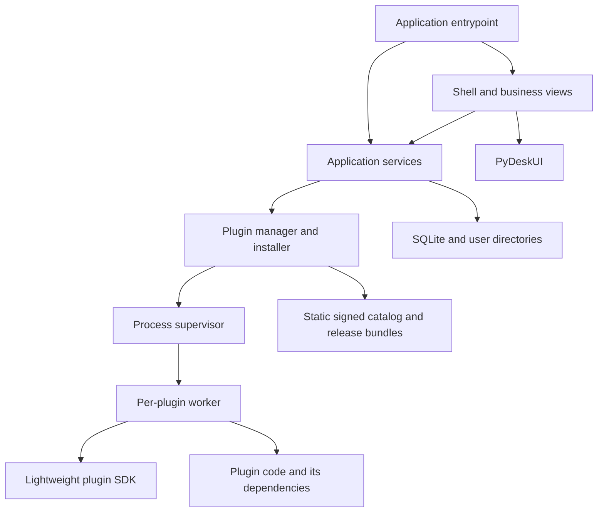

# Application architecture and composition API

> Updated: 2026-09-06. The shell, JSON Tools, and Image Compressor sections describe implemented behavior; later roadmap plugins remain proposals.

## Dependency direction



Host code never imports installed plugin modules. Discovery parses metadata; worker startup loads code only after installation, trust disclosure and enablement. The application owns one main Tk interpreter. A controller receives process events and schedules rendering on the GUI thread.

## Modules

| Target module | Responsibility |
|---|---|
| `pydesktools.app` | Toolkit shell entry, dependency assembly, startup/shutdown and distribution identity |
| `pydesktools.ui` | Tool home, plugin manager, plugin detail, command forms and result views |
| `pydesktools_runtime.services` | Commands, install jobs, user settings, event subscription |
| `pydesktools_runtime.plugins` | Manifests, catalog, version selection, lifecycle state and installation journal |
| `pydesktools_runtime.processes` | Interpreter selection, worker supervision, pipes, RPC and process-tree cleanup |
| `pydesktools_runtime.storage` | SQLite repositories, backups and paths |
| `pydesktools_runtime.platform` | Headless OS paths/process groups and platform adapter protocols |
| `pydesktools.platform` | Toolbox-supplied capture/clipboard/dialog GUI adapters |
| `packages/pydesktools-sdk` | Separately built SDK and worker entrypoint, no GUI dependency |

Prefer explicit dataclasses and a small number of service protocols over a generic dependency injection framework. Replace the device/anime model instead of carrying irrelevant abstractions forward.

## Headless services and public application composition

Factor headless services, plugin management, process supervision, storage and platform protocols into a separately buildable `pydesktools-runtime` package maintained here, importing as `pydesktools_runtime`, with no import of tkinter, PyDeskUI or the toolbox shell at module import. Each distribution owns a separate top-level import package; do not split files in one regular package across wheels. The SDK remains separate. The `pydesktools` application depends on this runtime and provides the default GUI/platform adapters. Other applications can install the runtime without shipping the toolbox interface or default plugins. GUI-capability adapters are explicitly supplied by their application; a headless runtime reports unsupported capability when no adapter is present. Avoid a fourth repository or private fork for these shared public services.

Provide `create_services(config, *, platform_adapter=None) -> ServiceContainer` and idempotent `ServiceContainer.close()` independently from GUI startup. ServiceContainer exposes the same commands/tasks facade described below, but no view registry. GUI `create_application` adds the optional view registry and shell. Distribution identity and plugin profile remain explicit; services cannot infer them from the free client installation. The application composition adapter and SDK are separately versioned from internal service implementation details.

## Public host composition contract

A downstream application may supply trusted modules at build time through `ApplicationConfig` and `ApplicationExtension`. These are application code shipped with that distribution, not dynamically installed plugins. The user-installable plugin model remains process-only.

Proposed API:

```python
# Interface sketch: proposed, not implemented.
from typing import Protocol

class ApplicationExtension(Protocol):
    id: str
    def register(self, services): ...  # returns an idempotent close handle

# ApplicationConfig(app_id, display_name, version, data_namespace,
#                   extensions=(), catalog_sources=())
# create_application(config) -> Application
# Application.run() -> int
```

`HostServices` exposes `commands.describe(plugin_id, command_id)`, `commands.submit(plugin_id, command_id, arguments, *, version=None) -> TaskHandle`, `tasks.subscribe(callback) -> CloseHandle`, and `views.register(view_id, factory) -> CloseHandle`. The view factory receives an explicit Tk parent and may compose PyDeskUI. It runs only on the main thread. The command facade checks installation, compatibility and admission, and returns structured SDK results.

`TaskHandle` has `id`, `cancel()` and completion/result events. `submit` is nonblocking. `describe` returns the cached validated descriptor, not a plugin import. `version` selects an installed retained version; at most one version of a given plugin ID may be active at a time. Incompatible concurrent version requests fail explicitly rather than silently switching another task's worker.

App identity controls OS data directories and visible branding. Extension registration occurs before rendering and returns handles closed in reverse order on shutdown. Distribution modules may add views and controllers but cannot reach into private plugin-manager internals. Public composition API additions receive contract tests with a minimal downstream application fixture.

## Concurrency and state flow

Use the Tk main thread for view/controller state; a bounded background service executor for installation/download operations; per-worker pipe readers and a serialized writer for messages. The SDK worker processes control messages independently from its single command execution slot. Long-running commands use cooperative cancellation; unresponsive workers can be terminated.

Process events carry session ID and task ID. UI adapters discard events from old sessions after disable, update or crash. Workers never call Tk methods. A bounded queue coalesces progress events; terminal events are not dropped. Queue saturation causes an explicit worker error rather than unlimited memory growth.

## Routed shell and first-party plugins

The host uses explicit `home`, `tool(plugin_id)`, `plugins`, and `settings` routes.
Home/tool routes share one 240px tool sidebar. Plugin management and settings replace
that shell with their own standalone sidebar, so two navigation containers are never
mounted at once. `Command-K`/`Control-K` opens the local command index from every route.

JSON Tools and Image Compressor ship as ordinary first-party plugins with complete
offline bundles. Image Compressor supports validated JPEG/PNG/WebP batch input,
orientation-aware resizing, metadata control, before/after artifacts, atomic outputs,
cancellation cleanup and default rejection of larger results. The [default-tool
specification](bundled-tools.md) owns broader future scope. Screenshot, Timestamp
Converter and Clipboard History remain roadmap work.

No plugin manager logic, catalog knowledge, license state or command schema belongs in PyDeskUI. Generic controls are requested upstream as independent primitives and consumed through released package versions.
