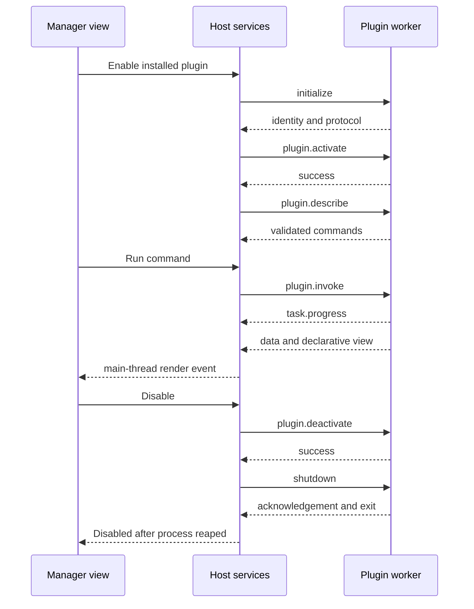

# Process protocol and declarative views

> Revised design: 2026-09-04; source audit: 2026-09-03 · Source revision: `c0918e8` · Target design, not implemented behavior.

## Transport

Proposed protocol 1 is JSON-RPC 2.0 over two inherited local pipes: host writes worker stdin; worker writes host stdout. Each UTF-8 JSON object occupies one line terminated by LF. Newlines within JSON strings are escaped. No BOM, batch requests, NaN/Infinity, duplicate object keys or pickle. Stderr is drained independently for bounded diagnostic logs.

Maximum frame size is 1 MiB including LF; JSON nesting limit is 32. Read with a byte limit before parsing. Oversized, malformed or unexpected frames close the session and record a protocol error. Hosts and workers serialize writes to prevent interleaving. JSON-RPC request IDs are strings: host IDs start `h-`, worker IDs start `w-`; IDs are unique within a process session. Respond with exactly one result or error for each request, never both. Ignore well-formed responses to canceled/expired requests; do not apply their UI changes.

Use bounded in-memory queues (256 events per worker), coalesce progress to at most 10 events/second/task, and disconnect workers that cannot respect flow control. Responses and lifecycle events have priority over progress. This is a local transport: no listening network port or shared authentication token is necessary. Inherited descriptors must not leak to unrelated children.

## Methods

| Direction | Method | Parameters / result |
|---|---|---|
| Host → worker | `initialize` | session_id, protocol=1, expected plugin_id/version, locale, data_dir, cache_dir, import_dir, export_dir; result protocol, plugin_id, version, sdk_version |
| Host → worker | `plugin.activate` | settings snapshot and allowed host capabilities; result `{}` after activate succeeds |
| Host → worker | `plugin.describe` | `{}`; result the SDK Descriptor |
| Host → worker | `plugin.invoke` | task_id, command_id, arguments; result `{data, view}` |
| Host → worker notification | `host.event` | subscription_id, event_id, payload; bounded event dispatch and unsubscribe semantics from platform contract |
| Host → worker notification | `task.cancel` | task_id; sets cancellation token, no immediate success guarantee |
| Worker → host notification | `task.progress` | task_id, fraction (null or 0–1), message |
| Worker → host | `host.call` | capability and arguments; result `{value: ...}` |
| Host → worker | `plugin.deactivate` | reason; result `{}` when hooks finish |
| Host → worker | `shutdown` | `{}`; result `{}`, then process exits |

Protocol requests before initialization, invokes before activation or duplicate live task IDs are rejected. Initialization has a 10-second budget; activate/describe each have 5 seconds. The SDK runner keeps the control reader responsive during command execution. `plugin.deactivate` runs after active invocation cancellation/finish; it is not executed concurrently with invoke on the same plugin instance. Graceful cleanup budgets are in the lifecycle document.

Base `host.call` operations `settings.get` and `settings.set` are always available after activation and operate only on the calling plugin's namespace. Optional calls use the declared names in the [platform/artifact contract](platform-and-artifacts.md), including capture, clipboard subscriptions and dialogs, plus `system.open_url`; the host derives caller identity from the session, never a supplied plugin ID. Single-file/save dialog cancellation returns `{value: null}`; multi-file selection cancellation returns `{value: []}`. Dialog calls receive at most five minutes, bounded further by the parent task deadline; canceling the parent task dismisses owned dialogs and ignores late responses. No command result can request execution outside this dispatch contract.

## Errors

Use standard JSON-RPC parse/invalid request/method/params/internal error codes. Application codes: -32001 incompatible, -32002 not active, -32003 permission denied, -32004 busy, -32005 canceled, -32006 deadline exceeded, -32007 invalid plugin result. Include `data.kind`, a stable English diagnostic identifier, and a user-facing message. Full tracebacks remain in local logs, with secrets and large input content redacted. A process exit without response becomes a host-generated task failure with `data.completion_unknown=true`; it is not a successful cancellation. Forced termination or loss of a write/external task response preserves that flag so downstream controllers can mark the operation ambiguous. Only an acknowledged safe cancellation may be presented as cleanly canceled.

There is one active invocation per plugin process in v1. Host queueing is bounded to 32 pending tasks per plugin; excess submissions return busy. IDs for transport requests and tasks are distinct. Every session carries a host-local generation so late pipe events from an old worker cannot affect the current UI.

## View model

Views are JSON data, never Python expressions, HTML or Tk commands. All visible strings supplied by the plugin are localized for the session locale. Rendering uses PyDeskUI primitives through an application-owned adapter.

| View type | Required fields | Optional fields / behavior |
|---|---|---|
| `form` | type, title, fields, submit | fields: id/label/kind/required/default/choices; submit action maps current values into command arguments |
| `list` | type, title, items | item id/title/subtitle; optional action per item; at most 1000 items per response |
| `detail` | type, title, body | format text/code (default text); actions array |
| `progress` | type, title, fraction | message; fraction null or 0–1; Cancel is a host task control |
| `image` | type, title, artifact_id | Host-managed PNG preview; actions and optional byte-count metadata; no inline binary |

An action is `{id, label, command_id, arguments}` and invokes a declared command in the same plugin. For form submit, field values replace the arguments dictionary after host input validation. Action IDs are unique within their view. An action does not name host Python functions, arbitrary URLs or another plugin. All commands still go through the same command facade and permissions checks.

Do not allow nested arbitrary layout trees in v1. Limit fields/actions to 100 per view and individual visible strings to 64 KiB. Result data remains separate from presentation so automation can consume it without parsing labels. A null view is valid; the host displays a generic result. Unknown view types fail the result validation with a visible plugin error rather than executing fallback code.

## Lifecycle example

[Protocol transcript](examples/protocol-session.json) is a complete successful illustrative exchange. It is stored as an array of direction/message records for review; actual transport sends only each message object as a separate line. [JSON-RPC specification](https://www.jsonrpc.org/specification), accessed 2026-09-03.
